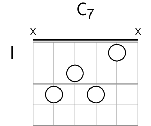
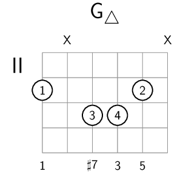
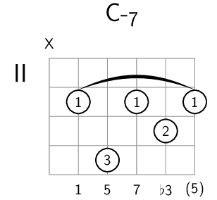
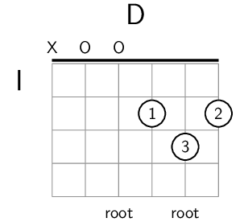

# Akkoord package for LaTeX
Drawing guitar chords using TikZ. Layout includes finger placement with free form fingername, Mute and Open above string, extra info below each string, position on left of chord, title on top of chord and automagically created bows.

Copyright 2017 Ronald Ligteringen <[r.ligteringen@gmail.com](mailto:r.ligteringen@gmail.com)>

# Usage

```latex
\akkoord[<position>]{<fret>/<finger>/<info>,f/f/i,... 6x}{<chord-name>}
```
* `<position>` is written on the left of the first fret
* `<fret>` indicates the finger placement and can be either `x` for mute, `o` (the letter) for open or a number indicating the fret starting with 1
* `<finger>` is written inside the finger placement indicating the used finger
* `<info>` is written below each string and can be used for extra info like actual note name or relative note in scale
* `<chord-name>` is written above the chord in the middle

# Note

* if the same finger is used more than once on the same fret a bar is drawn automagically between the lowest and highest snare
* `<position>` is optional and can be omitted, it will default to `I` (roman number)
* if `<fret>` is `x` (mute), `<finger>` and `<info>` are ignored
* if `<fret>` is `o` (open), `<finger>` contains the extra info and `<info>` is ignored
 (see D-chord example below)
* if `<finger>` is `-` it will be omitted
* if `<info>` is `-` it will be omitted
* `<chord-name>` is required

# Examples

```latex
\akkoord{x,3,2,3,1,x}{C\textsubscript{7}}
```
draws a C<sub>7</sub> chord with only circles on the finger placements and mute symbols on top. Defaulting to `I` the position is written on the left and a nut is drawn



```latex
\akkoord[II]{2/1/1,x,3/3/{$\sharp$7},3/4/3,2/2/5,x}{G\textsubscript{$\triangle$}}
```
draws a G<sub>&#9651;</sub> chord with fingers inside the circles and relative notes on the scale below the chord. Position `II` is written on the left (no nut)



```latex
\akkoord[II]{x,2/1/1,4/3/5,2/1/7,3/2/{$\flat$3},2/1/{(5)}}{C-\textsubscript{7}}
```
draws a C-<sub>7</sub> chord with a bow for finger 1 on the 2nd fret between 2nd snare from the left (A) and first snare from the right (high E)



```latex
\akkoord{x,o/-,o/{root},2/1/-,3/3/{root},2/2/-}{D}
```
draws a D chord with one mute and two open symbols on top and two `root`'s below the chord at the third snare from the left (D) and the second snare from the right (B)


